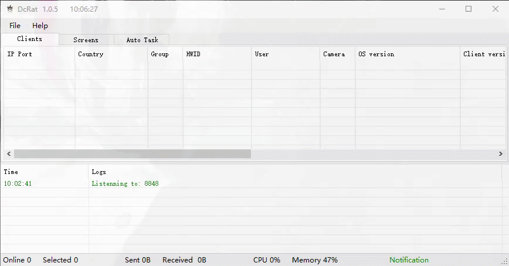

# DcRat

**DcRat is a simple remote tool written in C#**

## Screenshots

## Introduction
##### Features
- TCP connection with certificate verification, stable and security
- Server IP port can be archived through link
- Multi-Server,multi-port support
- Plugin system through Dll, which has strong expansibility
- Super tiny client size (about 40~50K)
- Data transform with msgpack (better than JSON and other formats)
- Logging system recording all events

##### Functions
- Remote shell
- Remote desktop
- Remote camera
- Registry Editor
- File management
- Process management
- Netstat
- Remote recording
- Process notification
- Send file
- Inject file
- Download and Execute
- Send notification
- Chat
- Open website
- Modify wallpaper
- Keylogger
- File lookup
- DDOS
- Ransomware
- Disable Windows Defender
- Disable UAC
- Password recovery
- Discord Recovery
- Open CD
- Lock screen
- Client shutdown/restart/upgrade/uninstall
- System shutdown/restart/logout
- Bypass Uac
- Get computer information
- Thumbnails
- Auto task
- Mutex
- Process protection
- Block client
- Install with schtasks
- etc

##### Deployment

- Build：vs2019
- Runtime：

|Project|Runtime|
|  ----  | ----  |
|Server|.NET Framework 4.61|
|Client and others|.NET Framework 4.0|

##### Support
* The following systems (32 and 64 bit) are supported
  * Windows XP SP3
  * Windows Server 2003
  * Windows Vista
  * Windows Server 2008
  * Windows 7
  * Windows Server 2012
  * Windows 8/8.1
  * Windows 10

##### TODO

- Password recovery and other stealer (only chrome and edge are supported now)
- Reverse Proxy
- Hidden VNC
- Hidden RDP
- Hidden Browser
- Client Map
- Real time Microphone
- Some fun function
- Information Collection(Maybe with UI)
- Support unicode in Remote Shell
- Support Folder Download
- Support more ways to install Clients
-  ……

## Compile

Open the project in Visual Studio 2019 and press CTRL+SHIFT+B.

## Download
Press [here](https://github.com/qwqdanchun/DcRat/releases/) to download the lastest release.

## Attention

我（簞純）对您由使用或传播等由此软件引起的任何行为和/或损害不承担任何责任。您对使用此软件的任何行为承担全部责任，并承认此软件仅用于教育和研究目的。下载本软件或软件的源代码，您自动同意上述内容。  
I (qwqdanchun) am not responsible for any actions and/or damages caused by your use or dissemination of the software. You are fully responsible for any use of the software and acknowledge that the software is only used for educational and research purposes. If you download the software or the source code of the software, you will automatically agree with the above content.

## Thanks

* SiMay - [@koko](https://gitee.com/dWwwang/SiMayRemoteMonitorOS)
* Quasar - [@Quasar](https://github.com/quasar/Quasar)
* Lime-RAT - [@NYAN-x-CAT](https://github.com/NYAN-x-CAT/Lime-RAT)
* vanillarat - [@dannythesloth](https://dannythesloth.github.io/VanillaRAT/)
* StreamLibrary - [@Rut0](https://github.com/Rut0/StreamLibrary)
* SharpChromium- [@djhohnstein](https://github.com/djhohnstein/SharpChromium)
* AForge.NET - [@andrewkirillov](https://github.com/andrewkirillov/AForge.NET)
* AsyncRAT - [@NYAN-x-CAT](https://github.com/NYAN-x-CAT/AsyncRAT-C-Sharp)
* SimpleMsgPack.Net - [@ymofen](https://github.com/ymofen/SimpleMsgPack.Net/)
* SharpSploit - [@cobbr](https://github.com/cobbr/SharpSploit)
* and some other projects

## License

This project is licensed under the MIT License - see the [LICENSE](/LICENSE) file for details
